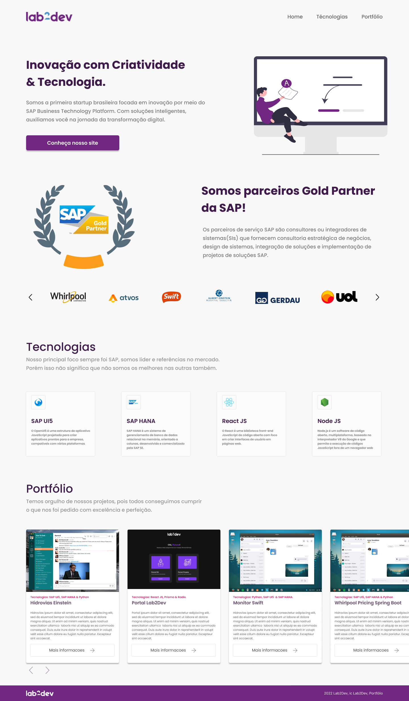

# Next Level Week - Feedget

This is the website of the main application of the Next Level Week bootcamp.

## 📄 Overview

The Feedget is a widget that collects feedbacks inside your application. The user can also take a screenshot of the page to send with the feedback.

You can see more in the [official website](https://nlw-return-i18n.vercel.app/)

### Web
  

    
    
  

