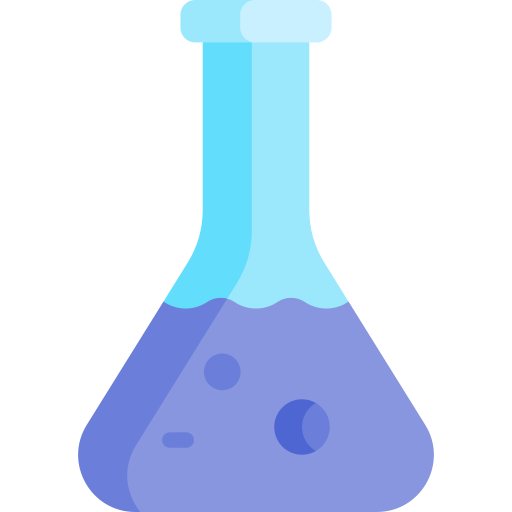
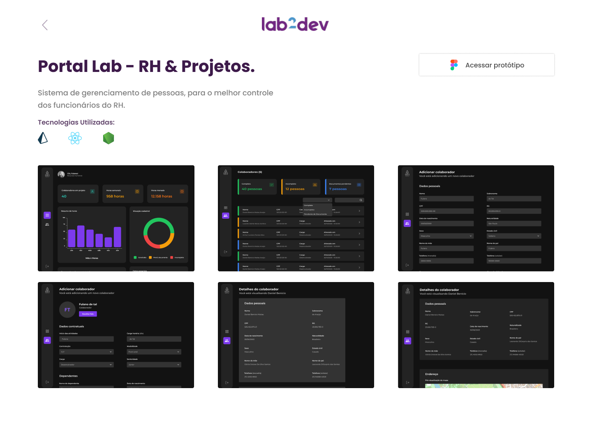

<p align="center">
  
</p>

<h1 align="center">
  Portfolio Lab2Dev
</h1>

This application was made in order to show the Project Portfolio of the company Lab2Dev

## Preview
  

  You can see more in the  [official website]( https://lab2dev-portfolio.vercel.app/)

## Technologies

### Next.js

Next.js gives you the best developer experience with all the features you need for production: hybrid static & server rendering, TypeScript support, smart bundling, route pre-fetching, and more. No config needed. (Source: Next.js)

[Official Website](https://nextjs.org/)

### Phosphor

Phosphor is a flexible icon family for interfaces, diagrams, presentations — whatever, really. (Source: Phosphor)

[Official website](https://phosphoricons.com/)

### Tailwind CSS

Rapidly build modern websites without ever leaving your HTML. (Source: Tailwind CSS)

Tailwind requires the use of the [postscss](https://postcss.org/)

### SheetDB

Turn a Google Spreadsheet into a JSON API

[Official website](https://sheetdb.io/)

## Additional Tools

### ESLint

ESLint is a tool for identifying and reporting on patterns found in ECMAScript/JavaScript code. (Source: ESLint)

[Official website](https://github.com/eslint/eslint)

### Prettier

Prettier is a code formatter. (Source: Prettier)

[Official website](https://prettier.io)

### Commitlint

Commitlint helps your team adhering to a commit convention. By supporting npm-installed configurations it makes sharing of commit conventions easy. (Source: Commitlint)

[Official website](https://commitlint.js.org)

### Commitizen

Commitizen define a standard way of committing rules and communicating it (using the cli provided by commitizen). (Source: Commitizen)

[Official website](https://commitizen-tools.github.io/commitizen/)

 ## Layout

- This project was developed using [Figma](https://www.figma.com/) 

Look at the prototype in this link: [Portfólio Lab2Dev]( https://www.figma.com/file/z0Jp1zj8QXRSEhth2NGqc0/LabPortf%C3%B3lio?node-id=0%3A1)

## Building

You'll need [Node.js](https://nodejs.org) installed on your computer in order to build this app.

```bash
git clone https://github.com/danielbenicio/lab2dev-portfolio.git
$ cd lab2dev-portfolio
$ npm install
$ npm run dev
```

Runs the app in the development mode.<br/>


